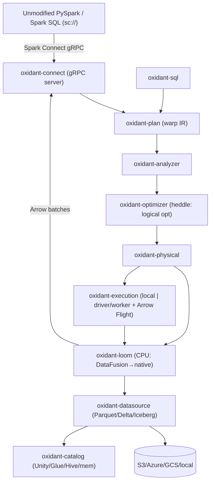

# Oxidant Architecture

This is the canonical in-repo architecture doc. It condenses the full project plan; when
the two disagree, this file wins for day-to-day engineering.

**Related maps:** [CODEMAP.md](CODEMAP.md) (ownership). Control-plane architecture
lives in the private **oxidant-platform** repo (`docs/ARCHITECTURE.md`).

## Thesis

A drop-in Apache Spark replacement that **beats Sail on CPU** with a lean vectorized core
(**Loom**) — a single execution backend, no second runtime. The irregular, graph-shaped
workloads no columnar engine serves well are planned as **Loom-native operators**
(CSR adjacency, factorized/worst-case-optimal joins, semi-naive recursion), not a
foreign evaluator. *"Oxidant starts where Sail ends."*

## The decision that shapes everything

The original pitch — "Bend is the execution substrate instead of Rust+DataFusion" —
cannot pass the Phase 1 exit criterion (beat Sail's absolute ClickBench times on CPU).
HVM2 has **no data plane** — 24-bit numerics, no hash table, no columnar/SIMD type, a
4 GB heap, no I/O or FFI, a CUDA/4090-only GPU path — so on ClickBench (pure
columnar/SIMD work) it loses **every** query. The full analysis, and the record of
removing the never-wired `oxidant-hvm` scaffold, lives in
[HVM_VERDICT.md](HVM_VERDICT.md).

| # | Decision |
|---|----------|
| D1 | **Single vectorized backend** — Loom carries every query; no second runtime |
| D2 | CPU core = **DataFusion now → native heavy-operator carve-out later** |
| D3 | **HVM2 bet closed: removed, never wired** ([HVM_VERDICT.md](HVM_VERDICT.md)); irregular/graph compute → Loom-native operators as a separate program |
| D4 | **Rust**; integration surface = **Spark Connect gRPC** |
| D5 | Diverge from Sail on its weak spots: distributed maturity, multi-tenant concurrency, streaming |

## Component graph

**Boundary contract:** everything between operators is Apache Arrow — no operator leaves
it, and no second runtime ever enters the query path.

**External catalogs:** `oxidant-catalog` is a pluggable, async `CatalogProvider` SPI; `oxidant-loom`
bridges it onto DataFusion's `CatalogProvider`/`SchemaProvider` so an external metastore resolves
table names **lazily** (the catalog is hit only when a query first references a table). Configure
one the Spark way — `spark.sql.catalog.<name>.type=hive` — or implement the trait. Hive Metastore
ships as the reference provider (`oxidant-catalog-hive`). See [catalogs.md](catalogs.md).

## How a GROUP BY actually runs

In `oxidant-loom`: a cache-efficient **radix-partitioned, open-addressing hash table with an
inline hash salt** (DuckDB/DataFusion design), morsel-driven across cores, spilling
partitions independently under memory pressure, with strategy adapted to estimated
cardinality. Per-row probe and the combine of partials alike stay in this vectorized
kernel — there is no second backend to hand a step to.

## The removed second backend (HVM2/Bend)

The `oxidant-hvm` scaffold (Bend codegen → HVM2 runtime) was removed: the runtime's
hard limits made it unusable for every query class Oxidant ships, and it was never
wired into a query path. Verdict, in-repo evidence, and the guardrails that replace
it: [HVM_VERDICT.md](HVM_VERDICT.md).

## Roadmap (exit criteria)

- **Phase 0** — Spark Connect server + embedded DataFusion; PySpark connects; TPC-H subset
  correct; all 43 ClickBench queries *run* (not yet beating Sail).
- **Phase 1** — native heavy operators + distributed MVP + Delta/Iceberg reads. **Exit: all
  43 ClickBench queries pass AND total hot ≤ Sail's (~56.3 s) on c6a.4xlarge, CPU-only,
  published as an independent ClickBench entry; median speedup vs Spark > 8.4×.**
- **Phase 2** — streaming + Kafka, Unity Catalog, K8s, multi-tenant concurrency.

## Success metric (north star)

Beat Sail's absolute ClickBench total on c6a.4xlarge (CPU-only). The total is dominated by
~10 queries — tie Sail on the cheap 33 (DataFusion parity), beat it 1.5–2× on the expensive
ones.

| Query (1-based) | Class | Sail (s) | Min ×0.9 | Strong ×0.5 | Loom lever |
|---|---|---:|---:|---:|---|
| Q1 `COUNT(*)` | scan/metadata | 0.014 | 0.013 | 0.007 | footer row-count + warm metadata |
| Q7 `MIN/MAX date` | scan/metadata | 0.015 | 0.014 | 0.008 | zone-map short-circuit, instant start |
| Q34 `GROUP BY URL` | high-card agg | 4.91 | 4.42 | 2.46 | adaptive hash-agg |
| Q35 `GROUP BY 1,URL` | high-card agg | 4.96 | 4.46 | 2.48 | adaptive hash-agg + const-fold |
| Q24 `… ORDER BY LIMIT 10` | sort/top-N | 10.2 | 9.18 | 5.10 | late-materialized top-N |
| **Total (hot)** | — | **≈56.3** | **≤56.3** | **≤28.2** | — |

**Single backend, honestly measured.** Recursive/graph-UDF and ML-in-query workloads —
the class no columnar engine serves — are planned as Loom-native operators (CSR
adjacency, factorized joins, semi-naive recursion) under the same benchmark-honesty
bar: they ship only with a published win on a defined workload.
